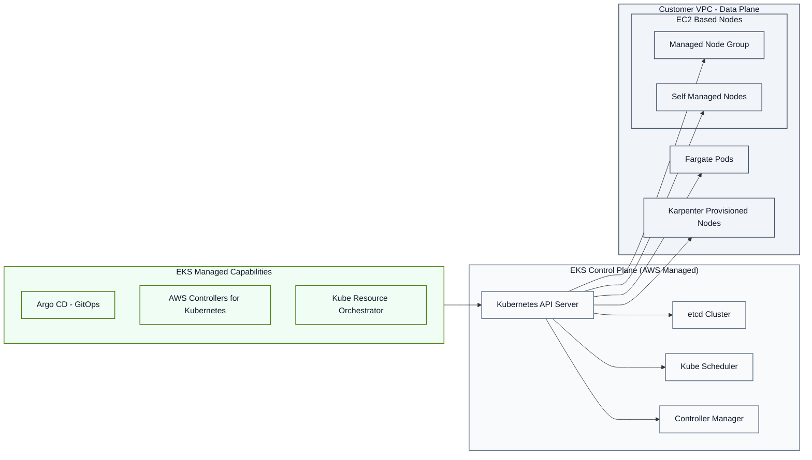

# Amazon EKS Architecture (Official AWS Docs Summary)

Amazon EKS’s architecture follows the standard Kubernetes cluster design while adding AWS-managed services to simplify operations and increase reliability.

## 1. Control Plane

The control plane is fully managed by AWS and runs as a dedicated, single-tenant control plane per cluster. It is designed for high availability, performance, and fault tolerance.

### Key Characteristics

- **Distributed across multiple Availability Zones (AZs):**  
  At least two API server instances and three etcd instances are deployed across AZs to ensure availability.

- **Resilience & monitoring:**  
  AWS continuously monitors and replaces unhealthy control plane instances and balances load across AZs.

- **Isolation:**  
  Each control plane runs inside its own Amazon VPC and cannot access other EKS clusters’ control planes.

## 2. Compute (Worker Nodes / Data Plane)

Worker nodes are customer-managed compute resources attached to the cluster. EKS supports several node types to suit different use cases.

### Node Types

- **EKS Auto Mode:**  
  AWS manages not only the control plane but also compute resources.  
  Adds built-in capabilities like autoscaling, networking, load balancing, storage, and GPU support.

- **AWS Fargate:**  
  Serverless compute — you don’t manage any EC2 instances.  
  Specify resource needs; AWS provisions and scales infrastructure automatically.

- **Karpenter:**  
  Kubernetes autoscaler that dynamically launches right-sized compute resources based on workload demands.

- **Managed Node Groups:**  
  AWS manages EC2 nodes — patching, updating, and scaling — with optional custom kubelet settings.

- **Self-Managed Nodes:**  
  You manage EC2 instances yourself.  
  Full control over the instance lifecycle and configuration.

- **Amazon EKS Hybrid Nodes:**  
  Extend worker nodes to on-premises or edge environments.  
  Kubernetes control plane stays managed by AWS, unified across environments.

## 3. EKS Capabilities

Amazon EKS also provides fully managed capabilities that integrate with Kubernetes to reduce operational burden.

### Key Capabilities

- **AWS Controllers for Kubernetes (ACK):**  
  Lets you manage AWS resources (e.g., S3, RDS) using Kubernetes APIs.

- **Argo CD:**  
  GitOps-based deployment automation that syncs Git with your clusters.

- **kro (Kube Resource Orchestrator):**  
  Creates reusable Kubernetes-native APIs to encapsulate complex resource patterns.

AWS fully manages the lifecycle of these capabilities — including patching, scaling, and monitoring — to reduce operational overhead.